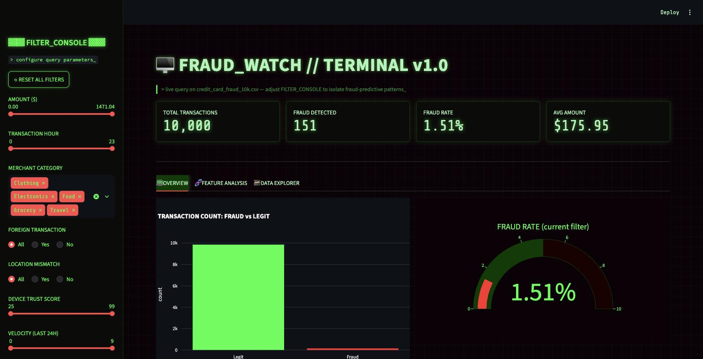
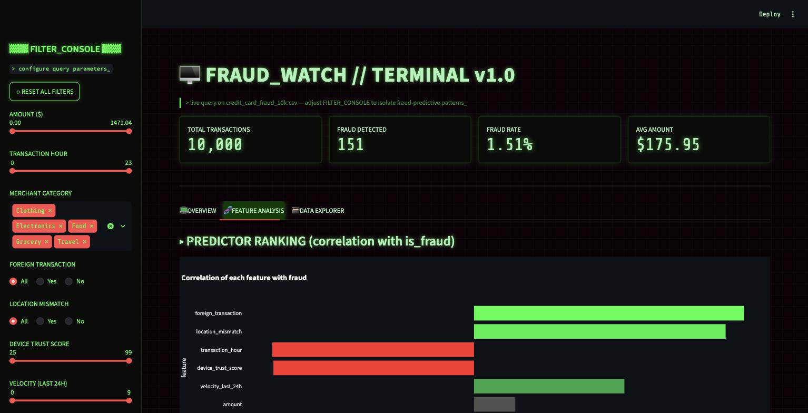
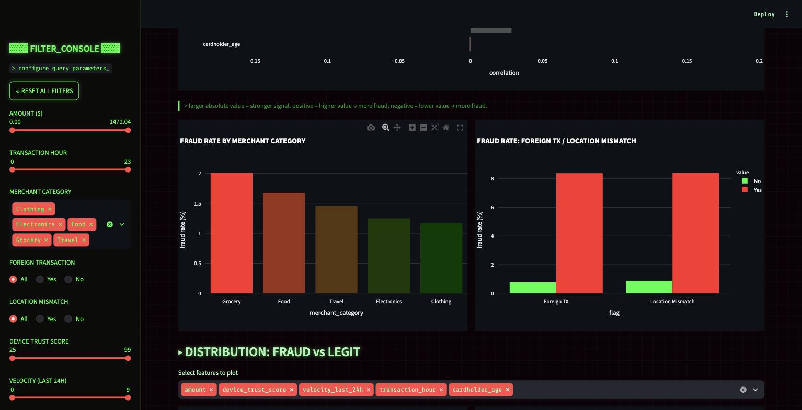
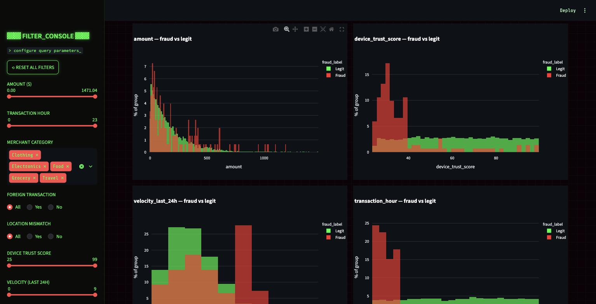
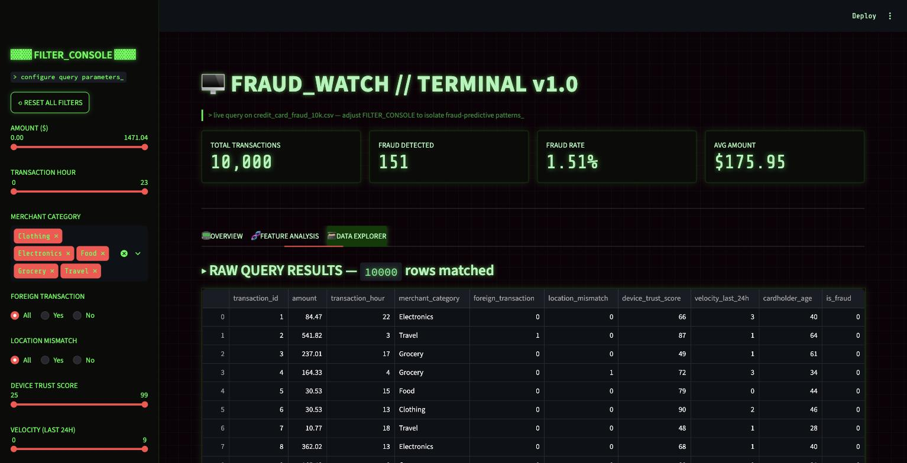

# FRAUD_WATCH // terminal

A Streamlit dashboard for exploring `credit_card_fraud_10k.csv` (10,000 credit-card transactions, 151 fraud cases) with a Matrix/hacker-terminal look — built to help spot which transaction attributes are most associated with fraud.

## Features

- **Filter console (sidebar):** filter by amount, transaction hour, merchant category, foreign transaction, location mismatch, device trust score, velocity (last 24h), cardholder age, and fraud status. A reset button clears all filters.
- **KPI row:** live total transactions, fraud count, fraud rate, and average amount for the current filter selection.
- **Overview tab:** fraud vs. legit counts and a fraud-rate gauge.
- **Feature Analysis tab:** a correlation ranking of every numeric feature against `is_fraud`, fraud rate by merchant category, fraud rate by foreign-transaction/location-mismatch flags, and overlaid fraud-vs-legit distribution histograms for the key numeric features — the core view for spotting fraud-predictive patterns.
- **Data Explorer tab:** sortable table of the filtered rows with a CSV download button.

## Screenshots

**Overview**


**Feature Analysis — predictor ranking**


**Feature Analysis — fraud rate by category / flags**


**Feature Analysis — fraud vs. legit distributions**


**Data Explorer**


## Running locally

```bash
pip3 install -r requirements.txt
streamlit run app.py
```

Then open the URL Streamlit prints (default `http://localhost:8501`).
